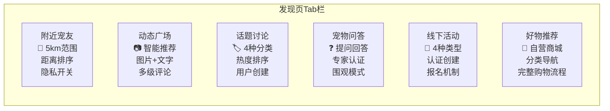
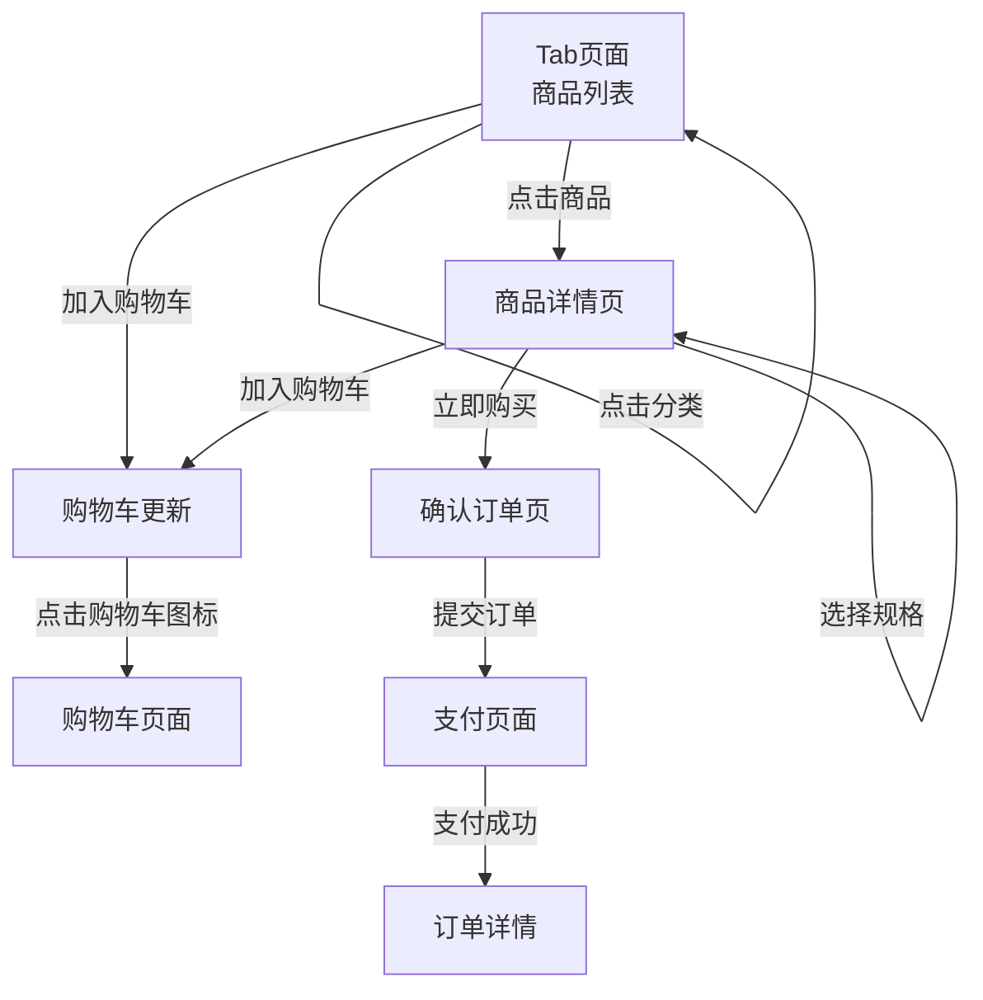

# 发现页 - 宠物社区设计方案

## 概述

为宠物定位器小程序设计「发现页」，定位为宠物社区 - 宠友互动社交平台，整合社交与电商功能，提供完整的宠物生活圈体验。

## 设计原则

- **内容优先**：社区产品核心是内容，信息流更符合用户习惯
- **统一体验**：各Tab设计语言一致，降低学习成本
- **社交驱动**：通过互动（点赞、评论、关注）激发用户参与
- **商业闭环**：社交种草到购买的无缝衔接

## 页面结构

```
┌─────────────────────────────────────────────────────────┐
│ 🔍 搜索框              🔔 消息通知                      │
├─────────────────────────────────────────────────────────┤
│ ┌─────┐ ┌─────┐ ┌─────┐ ┌─────┐ ┌─────┐ ┌─────┐        │
│ │附近 │ │动态 │ │话题 │ │问答 │ │活动 │ │好物 │        │ ← 可滑动Tab栏
│ │宠友 │ │广场 │ │讨论 │ │     │ │     │ │推荐 │        │
│ └─────┘ └─────┘ └─────┘ └─────┘ └─────┘ └─────┘        │
├─────────────────────────────────────────────────────────┤
│                                                         │
│                     Tab内容区域                         │
│                                                         │
├─────────────────────────────────────────────────────────┤
│        [发布动态]      [发布活动]      [购物车]         │
└─────────────────────────────────────────────────────────┘
```

## Tab结构（6个Tab）



---

## 1. 附近宠友 Tab（默认）

### 功能定位
基于地理位置的宠物社交发现，帮助用户找到身边的宠友。

### 详细设计

**卡片结构：**
```
┌─────────────────────────────┐
│  ┌─────┐                    │
│  │ 🐕  │  豆豆              │
│  │头像 │  金毛 · 200m · 🟢  │  ← 距离 + 在线状态
│  └─────┘  [打招呼] [看主页]  │
├─────────────────────────────┤
│  ┌─────┐                    │
│  │ 🐱  │  咪咪              │
│  │头像 │  布偶 · 500m · ⚪  │  ← 离线状态
│  └─────┘  [打招呼] [关注]    │
└─────────────────────────────┘
```

**核心规则：**
- **显示范围**：默认5km范围内
- **排序规则**：仅按距离由近到远排序
- **隐私控制**：设置中增加「允许被附近的人发现」开关，默认开启
- **卡片信息**：宠物头像、宠物昵称、品种、距离、在线状态
- **操作按钮**：打招呼、查看主页、关注

**空状态：**
- 引导开启定位权限
- 显示「开启定位发现附近宠友」按钮

---

## 2. 动态广场 Tab

### 功能定位
宠物内容分享社区，支持图片+文字发布，智能推荐算法排序。

### 详细设计

**瀑布流布局：**
```
┌─────────────────────────────────┐
│ ┌───────────┐ ┌───────────┐    │
│ │           │ │           │    │
│ │  图片1    │ │  图片2    │    │
│ │           │ │           │    │
│ │  👤用户A  │ │  👤用户B  │    │
│ │  ❤️128 💬32│ │  ❤️89 💬15│    │
│ └───────────┘ └───────────┘    │
│ ┌───────────┐ ┌───────────┐    │
│ │  图片3    │ │  图片4    │    │
│ └───────────┘ └───────────┘    │
└─────────────────────────────────┘
```

**核心规则：**
- **排序算法**：智能推荐（综合考虑热度+时间衰减）
- **内容类型**：图片+文字（暂不支持视频）
- **审核机制**：发布后需审核通过才可见（先审后发）
- **评论层级**：多级评论（支持无限层级嵌套回复）
- **互动功能**：点赞、评论、分享、收藏

**发布入口：**
- 右上角相机图标
- 支持选择图片（最多9张）
- 文字描述（最多500字）
- 可选添加话题标签

---

## 3. 话题讨论 Tab

### 功能定位
话题聚合讨论区，用户可参与热门话题或创建新话题。

### 详细设计

**页面结构：**
```
┌─────────────────────────────────────┐
│ 🔍 搜索话题                         │
├─────────────────────────────────────┤
│ 热门话题                            │
│ ┌────┐ ┌────┐ ┌────┐ ┌────┐        │
│ │日常│ │求助│ │晒图│ │知识│        │ ← 分类标签
│ └────┘ └────┘ └────┘ └────┘        │
├─────────────────────────────────────┤
│                                     │
│  #我家宠物的奇怪习惯         🔥2.3k │
│  已有 1.2k 人参与讨论               │
│  ─────────────────────────────      │
│  #新手养猫指南               🔥1.8k │
│  已有 856 人参与讨论                │
│  ─────────────────────────────      │
│  #遛狗好去处推荐             🔥1.5k │
│  已有 723 人参与讨论                │
│                                     │
├─────────────────────────────────────┤
│        [ + 创建新话题 ]              │
└─────────────────────────────────────┘
```

**核心规则：**
- **预置分类**：日常、求助、晒图、知识（4种分类标签）
- **创建规则**：用户创建话题需选择分类，无需审核
- **热度计算**：按参与人数+浏览量综合排序
- **话题详情**：展示该话题下的所有动态聚合

**话题详情页：**
- 话题头部：标题、描述、参与人数、热度
- 内容列表：该话题下的动态（瀑布流展示）
- 参与按钮：「参与讨论」跳转动态发布页

---

## 4. 宠物问答 Tab

### 功能定位
问答社区，用户提问，专家回答，形成知识沉淀。

### 详细设计

**页面结构：**
```
┌─────────────────────────────────────┐
│ 🔍 搜索问题              [ + 提问 ] │
├─────────────────────────────────────┤
│  ┌───┐ ┌───┐ ┌───┐ ┌───┐          │
│  │训练│ │健康│ │饮食│ │行为│          │ ← 问题分类
│  └───┘ └───┘ └───┘ └───┘          │
├─────────────────────────────────────┤
│                                     │
│ Q: 狗狗总是咬沙发怎么办？   👁️ 1.2k │
│    👤 小明 · 3天前                 │
│    [3个回答]  [关注问题]            │
│  ─────────────────────────────      │
│ Q: 猫咪换粮需要注意什么？   👁️ 856  │
│    👤 猫奴小李 · 5天前              │
│    [1个回答]  [已有专家回答]        │
│  ─────────────────────────────      │
│                                     │
├─────────────────────────────────────┤
│  推荐专家                           │
│ ┌───┐ ┌───┐ ┌───┐                  │
│ │👨‍⚕️│ │👩‍⚕️│ │👨‍⚕️│                  │
│ │张医│ │李医│ │王兽│                  │
│ │生  │ │生  │ │医  │                  │
│ └───┘ └───┘ └───┘                  │
└─────────────────────────────────────┘
```

**核心规则：**
- **内容形式**：问答社区（用户提问，专家回答）
- **专家认证**：邀请制或申请制，通过后显示认证标识
- **互动方式**：
  - 用户提问（选择分类，描述问题）
  - 专家回答（认证专家可回答，显示专家标识）
  - 围观模式（其他用户可查看问题和答案，可点赞优质回答）
- **问题分类**：训练、健康、饮食、行为

**专家认证标识：**
- 医生图标 + 「认证兽医」「认证训练师」等标签
- 专家主页展示：回答数、获赞数、专业领域

---

## 5. 线下活动 Tab

### 功能定位
宠物线下活动发布与报名平台，连接线上社交与线下互动。

### 详细设计

**页面结构：**
```
┌─────────────────────────────────────┐
│ 🔍 搜索活动              [ + 发布 ] │
├─────────────────────────────────────┤
│ ┌──┐ ┌──┐ ┌──┐ ┌──┐                │
│ │全部│聚会│比赛│义诊│领养日          │ ← 活动类型筛选
│ └──┘ └──┘ └──┘ └──┘                │
├─────────────────────────────────────┤
│                                     │
│ ┌─────────────────────────────────┐ │
│ │ 🎉 周末狗狗聚会               │ │
│ │ 📍 朝阳公园 · 2km             │ │
│ │ 📅 3月20日 14:00              │ │
│ │ 👥 12/30人已报名              │ │
│ │     [立即报名]                │ │
│ └─────────────────────────────────┘ │
│ ┌─────────────────────────────────┐ │
│ │ 🏆 宠物才艺大赛               │ │
│ │ 📍 万达广场 · 5km             │ │
│ │ 📅 3月25日 10:00              │ │
│ │ 👥 45/100人已报名             │ │
│ │     [立即报名]                │ │
│ └─────────────────────────────────┘ │
│                                     │
├─────────────────────────────────────┤
│  我的活动：已报名(2) | 已结束(3)    │
└─────────────────────────────────────┘
```

**核心规则：**
- **活动类型**：聚会、比赛、义诊、领养日（4种）
- **创建权限**：认证用户可创建（需达到一定等级/积分）
- **取消政策**：组织者可提前24小时取消活动
- **人数限制**：活动可设置人数上限，满员后显示「已满员」
- **报名机制**：免费报名（暂不支持付费活动）

**活动卡片要素：**
1. 活动标题
2. 活动地点 + 距离
3. 活动时间（日期+具体时间）
4. 报名人数/人数上限
5. 立即报名按钮

---

## 6. 好物推荐 Tab（新增）

### 功能定位
自营宠物商城，提供从种草到购买的无缝购物体验。

### 详细设计

**页面结构：**
```
┌─────────────────────────────────────┐
│ 🔍 搜索商品            🛒 购物车(3) │
├─────────────────────────────────────┤
│ ┌──┐ ┌──┐ ┌──┐ ┌──┐ ┌──┐ ┌──┐    │
│ │全部│主粮│零食│玩具│用品│医疗│    │ ← 分类标签
│ └──┘ └──┘ └──┘ └──┘ └──┘ └──┘    │
├─────────────────────────────────────┤
│                                     │
│ ┌─────────────┐ ┌─────────────┐    │
│ │             │ │             │    │
│ │   商品图    │ │   商品图    │    │
│ │             │ │             │    │
│ │ ¥128  ❤️234│ │ ¥89   ❤️89 │    │
│ │ 进口天然猫粮 │ │ 宠物饮水机 │    │
│ │ 已有1.2k购买 │ │ 已有500购买│    │
│ │ [加入购物车] │ │ [加入购物车]│    │
│ └─────────────┘ └─────────────┘    │
│                                     │
│ ┌─────────────┐ ┌─────────────┐    │
│ │   商品图    │ │   商品图    │    │
│ └─────────────┘ └─────────────┘    │
│                                     │
├─────────────────────────────────────┤
│      🛒 购物车 (¥256)  [去结算]      │  ← 底部悬浮栏
└─────────────────────────────────────┘
```

**核心规则：**
- **商品展示**：分类列表形式，顶部标签栏+下方商品网格
- **商品分类**：全部、主粮、零食、玩具、用品、医疗（6种）
- **购买流程**：小程序内完整流程（选品→购物车→下单→支付→订单管理）
- **商品来源**：自营商城（平台自己上架商品、管理库存）

**分类标签：**
| 标签 | 商品类型 | 示例 |
|------|----------|------|
| 全部 | 所有商品 | - |
| 主粮 | 猫粮/狗粮/处方粮 | 渴望、爱肯拿、皇家 |
| 零食 | 罐头/冻干/磨牙棒 | 巅峰罐头、鸡胸肉干 |
| 玩具 | 逗猫棒/咬胶/益智玩具 | 电动老鼠、漏食球 |
| 用品 | 猫砂/牵引绳/窝垫 | 豆腐猫砂、航空箱 |
| 医疗 | 驱虫药/保健品/护理 | 大宠爱、化毛膏 |

**商品卡片要素：**
1. 商品主图（正方形，占卡片上半部分）
2. 价格（¥符号+数字，醒目绿色）
3. 收藏数（心形图标+数字）
4. 商品名称（最多两行省略）
5. 销量提示（「已有xx人购买」）
6. 加入购物车按钮（绿色渐变按钮）

**核心页面流程：**


---

## 视觉风格

### 色彩系统
- **主色调**：绿色系渐变（`#56ab2f` → `#a8e063`）
- **背景色**：温暖奶油色（`#faf9f6`）
- **卡片色**：纯白（`#ffffff`）+ 柔和阴影
- **强调色**：橙色（`#ff9500`）用于价格、热度等
- **文字色**：
  - 主文字：`#333333`
  - 次要文字：`#666666`
  - 辅助文字：`#999999`

### 布局规范
- **Tab栏高度**：80rpx
- **卡片圆角**：16rpx
- **卡片阴影**：`0 2rpx 12rpx rgba(0,0,0,0.06)`
- **触控区域**：>= 88rpx（44px）
- **页面边距**：30rpx（左右）

### 动效规范
- **Tab切换**：200ms ease
- **卡片点击**：scale(0.98) 150ms
- **点赞动画**：scale(1.2) → scale(1) 300ms + 心形飘动
- **加载更多**：底部loading旋转

---

## 数据结构

### 附近宠友
```javascript
{
  id: 'user_123',
  pet: {
    name: '豆豆',
    avatar: 'https://...',
    breed: '金毛',
    gender: 'male'
  },
  owner: {
    nickname: '小明',
    avatar: 'https://...'
  },
  distance: 200,  // 米
  isOnline: true,
  location: {
    lat: 39.9,
    lng: 116.4
  }
}
```

### 动态广场
```javascript
{
  id: 'post_456',
  author: {
    id: 'user_123',
    nickname: '小明',
    avatar: 'https://...',
    pet: { name: '豆豆', breed: '金毛' }
  },
  content: '今天带豆豆去公园玩，超级开心！',
  images: ['https://...', 'https://...'],
  topics: ['遛狗好去处'],
  stats: {
    likes: 128,
    comments: 32,
    shares: 8,
    collections: 15
  },
  isLiked: false,
  isCollected: false,
  createdAt: '2026-03-13T10:30:00',
  status: 'approved'  // pending/approved/rejected
}
```

### 话题讨论
```javascript
{
  id: 'topic_789',
  title: '我家宠物的奇怪习惯',
  category: 'daily',  // daily/help/photo/knowledge
  description: '分享你家宠物的各种奇怪小习惯',
  icon: 'https://...',
  stats: {
    participants: 1200,
    views: 8500,
    posts: 356
  },
  heat: 2300,
  isHot: true,
  createdBy: 'official',  // official/user
  createdAt: '2026-01-15'
}
```

### 宠物问答
```javascript
{
  id: 'question_101',
  title: '狗狗总是咬沙发怎么办？',
  category: 'behavior',
  content: '详细描述问题...',
  author: {
    id: 'user_111',
    nickname: '小明',
    avatar: 'https://...'
  },
  answers: [
    {
      id: 'answer_202',
      content: '回答内容...',
      author: {
        id: 'expert_333',
        nickname: '张医生',
        avatar: 'https://...',
        isExpert: true,
        expertTitle: '认证兽医'
      },
      likes: 45,
      isAccepted: true,
      createdAt: '2026-03-13T11:00:00'
    }
  ],
  stats: {
    views: 1200,
    follows: 23,
    answerCount: 3
  },
  status: 'resolved',  // open/resolved
  createdAt: '2026-03-10'
}
```

### 线下活动
```javascript
{
  id: 'activity_303',
  title: '周末狗狗聚会',
  type: 'gathering',  // gathering/competition/medical/adoption
  cover: 'https://...',
  location: {
    name: '朝阳公园',
    address: '北京市朝阳区...',
    lat: 39.9,
    lng: 116.4,
    distance: 2000
  },
  time: {
    start: '2026-03-20T14:00:00',
    end: '2026-03-20T17:00:00'
  },
  organizer: {
    id: 'user_444',
    nickname: '活动达人',
    avatar: 'https://...',
    isVerified: true
  },
  capacity: {
    max: 30,
    current: 12
  },
  stats: {
    views: 520,
    shares: 15
  },
  isJoined: false,
  status: 'open',  // open/full/ended/cancelled
  createdAt: '2026-03-05'
}
```

### 好物推荐
```javascript
{
  id: 'product_505',
  name: '进口天然猫粮 5kg',
  category: 'food',  // food/snack/toy/supply/medical
  images: ['https://...', 'https://...'],
  price: 128.00,
  originalPrice: 158.00,
  sales: 1200,
  likes: 234,
  stock: 99,
  specs: [
    { name: '规格', values: ['1kg', '5kg', '10kg'] },
    { name: '口味', values: ['鸡肉', '鱼肉'] }
  ],
  description: '详细商品描述...',
  rating: 4.8,
  reviewCount: 156,
  isLiked: false,
  tags: ['热销', '包邮']
}
```

---

## 页面路由规划

```javascript
// app.json 页面注册
{
  "pages": [
    "pages/discover/discover",           // 发现页主入口
    "pages/discover/nearby",             // 附近宠友详情
    "pages/discover/feed-detail",        // 动态详情
    "pages/discover/topic-detail",       // 话题详情
    "pages/discover/question-detail",    // 问答详情
    "pages/discover/activity-detail",    // 活动详情
    "pages/discover/product-detail",     // 商品详情
    "pages/discover/cart",               // 购物车
    "pages/discover/order-confirm",      // 确认订单
    "pages/discover/order-detail",       // 订单详情
    "pages/discover/post-create",        // 发布动态
    "pages/discover/activity-create",    // 发布活动
    "pages/discover/question-create",    // 提问
    "pages/discover/user-profile"        // 用户主页
  ]
}
```

---

## 待办事项

- [ ] 创建 discover 页面主框架（Tab切换、搜索栏、底部发布栏）
- [ ] 实现附近宠友Tab（定位、地图组件、距离计算）
- [ ] 实现动态广场Tab（瀑布流、智能推荐、发布功能）
- [ ] 实现话题讨论Tab（分类、话题列表、创建话题）
- [ ] 实现宠物问答Tab（问答列表、提问、专家认证）
- [ ] 实现线下活动Tab（活动列表、报名、创建活动）
- [ ] 实现好物推荐Tab（商品列表、购物车、下单流程）
- [ ] 设计并实现各详情页（动态、话题、问答、活动、商品）
- [ ] 实现发布功能（动态、活动、提问）
- [ ] 配置审核系统（动态、话题）
- [ ] 对接支付系统（商品购买）
- [ ] 实现消息通知系统

---

## 总结

本设计方案为宠物定位器小程序打造了一个完整的「发现页」，整合6大功能模块：

1. **附近宠友** - 基于位置的宠物社交发现
2. **动态广场** - 宠物内容分享社区（智能推荐、先审后发）
3. **话题讨论** - 话题聚合讨论（分类标签、热度排序）
4. **宠物问答** - 问答社区（用户提问、专家回答）
5. **线下活动** - 宠物活动发布与报名平台
6. **好物推荐** - 自营宠物商城（完整购物流程）

整体采用信息流型设计，统一视觉风格（绿色系渐变），强调内容消费体验和社交互动，同时通过「好物推荐」Tab实现商业闭环。

---

*设计文档版本: 1.0*
*创建日期: 2026-03-13*
